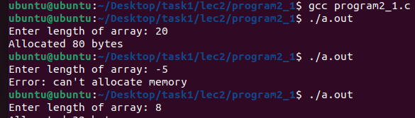
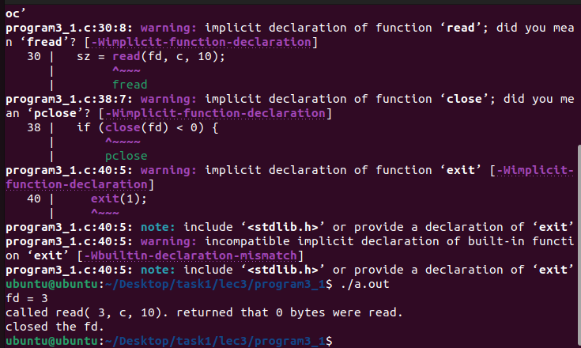
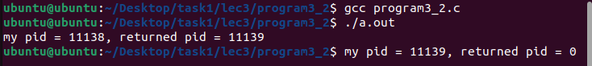
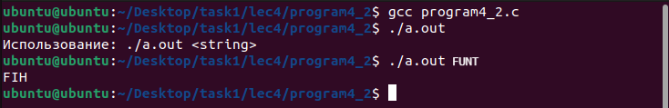
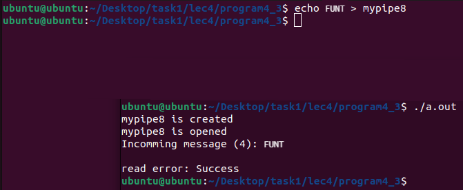

# Первое задание 
Программы из лекций по "Сетевым Операционным Системам".
## Установка
Каждую программу можно скомпилировать с помощью `gcc <название_программы.c>`. В директории создается исполняемый файл `a.out`, который можно запустить с помощью `./a.out`.  
Или же использовать `gcc <название_программы.c> -o <название_скомпилированной_программы.out>`, тогда в директории создастся исполняемый файл, который можно запустить через `./название_скомпилированной_программы.out`.     
Проще запустить Makefile, он лежит в папке с ридми. Запускается с помощью строки - `make all`.  
Далее в папке каждой программы будет создан исполняемый файл (с расширением `.out`).  
Также можно использовать `make lec2`, если нет надобности во всех лекциях. Или же `make Program41` если нужна конкретная программа.  
На каких платформах будут работать программы: 
Linux - да 
Windows - нет 
Mac OS - нет  
# скриншоты

