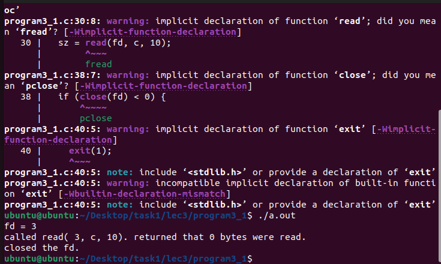

# Программа 3_1 
Сначала программа просит выделяет память для массива элементов типа char . Затем приложение открывает файл foo.txt для чтения и необходимости создания. Затем происходит вывод значения дескриптора файла. После этого приложение прочтёт из файла 10 байт и запишет полученное количество информации в переменную sz. Затем программа запишет в конец массива терминальный ноль и закроет файл.
# скриншоты

