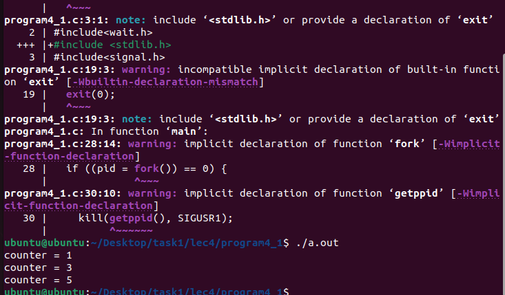

# Программа 4_1 
<!-- Сначала программа получает сигнал от пользователя и обрабатывает его. Далее, задаётся  переменная-счётчик "counter". Также в программе присутствуют две обрабатывающие функции - "handler1" и "handler2". Они принимают агрумент типа int. Handler1 увеличивает счётчик на 1 и отправляет сигнал дочернему. Обработка выглядит следующим образом: Программа привязывает первую функцию обработки к текущему процессу. Далее, если процесс окажется дочерним, сигнал будет обрабатывать функция handler2. -->
# скриншоты

