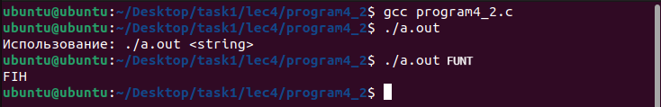

# Программа 4_2 
Сначала программа создаёт массив файловых дескрипторов. После приложение проверит корректность ввода и сообщит об ошибке, если нужно. Затем программа вызовет fork() для получения PID'а дочернего процесса. Дальше приложение проверит только что полученный PID. Далее родительский процесс пишет что-либо в канал, а дочерний читает. Таким образом реализуется общение между процессами с помощью канала.
# скриншоты

