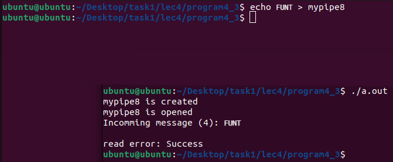

# Программа 4_3 
Сначала программа создаёт дескриптор и канал с правами доступа для всех. После этого запускается бесконечный цикл, в котором приложение прослушивает его. Если программа получила сообщение, она выведет количество символов (учитывая терминальный ноль) и сам текст.
# скриншоты

